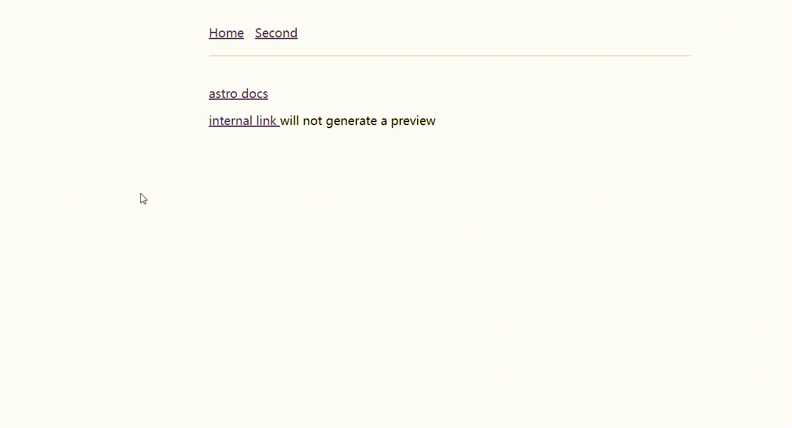

<h1 align="center">
  <code>astro-link-preview</code>
</h1>

<p align="center">
  <a href="https://badge.fury.io/js/astro-link-preview">
    
  </a>
</p>

<p align="center">
  <strong>
  This <code>Astro</code> integration generates preview images for external links.
  </strong>
</p>

<br>



## Installation

```shell
# Using NPM
npm install astro-link-preview
# Using Yarn
yarn add astro-link-preview
# Using PNPM
pnpm add astro-link-preview
```

## Config

```js
// astro.config.mjs
import {defineConfig} from "astro/config"
import linkPreview from "astro-link-preview"
export default defineConfig({
  integrations: [
    linkPreview()
  ],
})
```


## Options 

```ts
import type { LaunchOptions } from '@playwright/test'

export interface Options {
  /**
   * Whether to log stats
   * @default true
   */
  logStats?: boolean
  /**
   * proxy settings
   */
  proxy?: LaunchOptions['proxy']
  /**
   * preview image format
   * @default 'jpg'
   */
  previewImageFormat?: 'png' | 'jpg'
}
```

## How to use

see [example](../playground/)

## License

MIT &copy; [nemurubaka](https://github.com/cijiugechu)